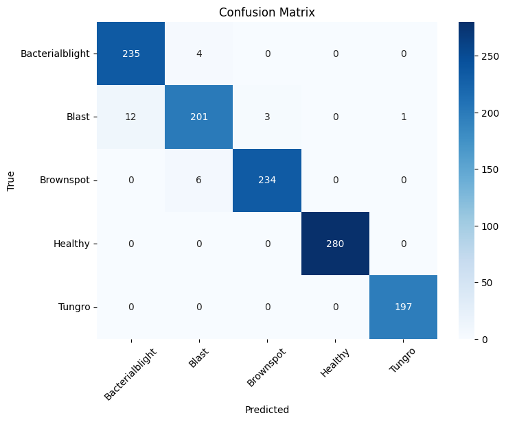

# 🌾 Rice Leaf Disease Detection with CNN

This project uses a Convolutional Neural Network (CNN) to classify rice leaf images into several categories of diseases and healthy leaves. The dataset is sourced from [Hugging Face](https://huggingface.co/).

## 📂 Dataset
- 5 classes:
  - bacterial_blight
  - blast
  - brownspot
  - healthy
  - tungro
- Image size: 180x180 (resized)

## 🧠 Model
- CNN with 3 convolutional layers
- Optimizer: Adam
- Loss: Categorical Crossentropy

---

## 📂 Project Structure
```
project-root/
│
├── app.py               # Gradio app for deployment
├── predict.py           # Script for single image prediction
├── train.py             # Model training script
│
├── models/              # Saved model files (.h5)
├── notebooks/           # Jupyter notebooks (experiments, EDA)
├── docs/                # Documentation assets (images, diagrams)
├── requirements.txt
└── README.md
```

---

## ⚙️ Installation

1. Clone this repository:
   ```bash
   git clone https://github.com/your-username/rice-leaf-disease-detection.git
   cd rice-leaf-disease-detection
   ```

2. Install dependencies:
   ```bash
   pip install -r requirements.txt
   ```

---

## 🚀 Usage

### Training
```bash
python train.py
```

### Prediction
```bash
python predict.py --image path_to_image.jpg
```

### Run Gradio App
```bash
python app.py
```

---

## 📊 Model Performance

- **Accuracy**: ~98% (on test set)  
- **Loss**: 0.12~

**Classification Report:**
```
                precision    recall  f1-score   support

Bacterialblight       0.95      0.98      0.97       239
          Blast       0.95      0.93      0.94       217
      Brownspot       0.99      0.97      0.98       240
        Healthy       1.00      1.00      1.00       280
         Tungro       0.99      1.00      1.00       197

       accuracy                           0.98      1173
      macro avg       0.98      0.98      0.98      1173
   weighted avg       0.98      0.98      0.98      1173

```

**Confusion Matrix:**



---

## 🛠️ Tech Stack
- Python 3.9+
- TensorFlow / Keras
- NumPy, Pandas
- Matplotlib, Seaborn
- scikit-learn
- Gradio (for deployment)

---

## 📌 Notes
- Dataset downloaded from Hugging Face.  
- Model saved in `models/` directory after training.  
- Update `predict.py` and `app.py` paths as needed before running.

---

## 📜 License
MIT License. See `LICENSE` for details.
